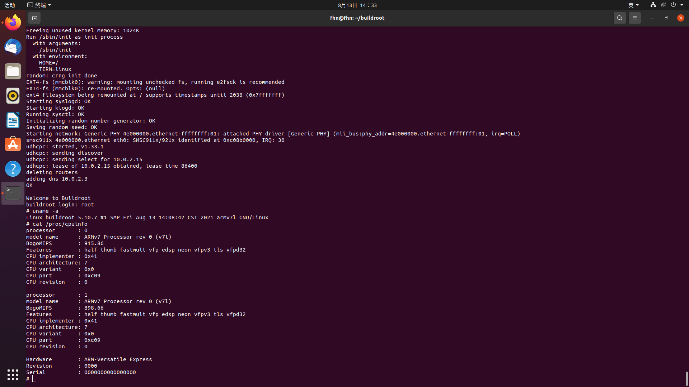
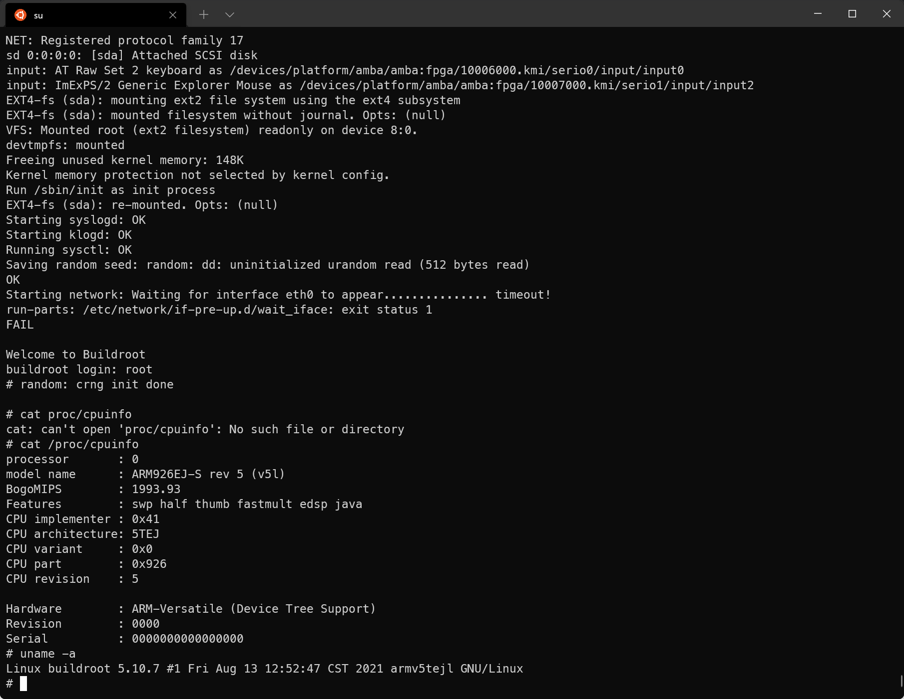

## lab1 在 qemu 中运行自己的文件系统和内核
### 要求：
1. 内核与文件系统都使用源代码编译生成二进制目标文件，通过 qemu 测试运行自己的内核与文件系统。
2. 使用 buildroot 即可完成，体系结构推荐使用 arm（具体开发板类型不限），也可以使用 x86（相对简单些）生成 Linux 操作系统的内核和可用的文件系统，用 qemu 进行测试。

### 报告要求：
1. 说明自己使用的源代码版本，基本操作过程，和最终成品截图。
2. 截图要使用 uname -a 命令显示所使用的内核版本号。
3. 在操作过程中遇到的主要问题和解决方法是什么。

参考资料：网络

## 知识补充
### QEMU
QEMU（quick emulator）是一款由法国天才程序员法布里斯·贝拉（Fabrice Bellard）等人编写的开源虚拟机，通过纯软件方法来实现模拟硬件。
在lab中我们可以借此实现模拟所需的arm和x86硬件。

除了x86、arm等系统架构的CPU、内存、IO，以及zynq相关硬件等，QEMU可以模拟多种硬件设备，包括键盘、串口、声卡以及其他一些USB设备。在这个模拟层上，可以运行一台arm虚拟机，这个arm虚拟机认为自己在和硬件进行交互，但实际上这些硬件都是QEMU模拟的。

由于是纯软件方法模拟，所以相对于实际硬件来说，效率相对较低，在实际生产环境中，可以与KVM一起使用快速地运行虚拟机。因为KVM是由硬件辅助的虚拟化技术，主要负责比较繁琐的CPU和内存虚拟化，而QEMU只需要模拟IO设备，二者相互协作，其速度与物理计算机接近。


### buildroot
Buildroot是一组Makefile和Patch文件，用来简化和自动化为嵌入式系统**建造一个完整和可引导的Linux环境**的过程，特别是在使用交叉编译来允许在单一的基于Linux的开发系统上为多个目标平台进行建造的时候。

Buildroot可以自动建造所需要的交叉编译工具链，创建根文件系统，编译一个Linux内核映像，并为目标嵌入式系统生成引导装载器，它还可以进行这些独立步骤的任何组合。例如可以独立的使用已经安装好的交叉编译工具链，而只用Buildroot创建根文件系统。

Buildroot主要意图用于小型或嵌入式系统，它们基于各种计算机体系结构和指令集之上，包括x86、ARM、MIPS和PowerPC。不仅支持大量的架构及其变体，Buildroot还随带了针对一些现成的嵌入式开发板的缺省配置，比如Cubieboard（页面存档备份，存于互联网档案馆）、Raspberry Pi等。一些第三方项目和产品使用Buildroot作为其建造系统的基础，包括创建了嵌入式操作系统的OpenWrt计划，和Google Fiber宽带服务所用的用户驻地设备的固件。

## 操作方法


参考https://www.cnblogs.com/arnoldlu/p/9689585.html中给出的实现方式。

首先安装必要的依赖：
```shell
sudo apt install gcc build-essential bison flex gettext tcl sharutils libncurses-dev zlib1g-dev exuberant-ctags g++ texinfo patch vim libtool bc git
```

安装qemu工具：
```shell
sudo apt install qemu-system-arm
```

下载buildroot
```shell
git clone git://git.buildroot.net/buildroot
cd buildroot/
```

随后使用
```shell
make qemu_arm_vexpress_defconfig
```
语句

make之后会出现错误
```shell
applets/applet_tables: duplicate applet name 'setarch'
applets/applet_tables: duplicate applet name 'setpriv'
applets/applet_tables: duplicate applet name 'setsid'
applets/applet_tables: duplicate applet name 'swapoff'
applets/applet_tables: duplicate applet name 'swapon'
applets/applet_tables: duplicate applet name 'switch_root'
applets/applet_tables: duplicate applet name 'uevent'
applets/applet_tables: duplicate applet name 'umount'
applets/applet_tables: duplicate applet name 'xxd'
make[2]: *** [applets/Kbuild:45: include/NUM_APPLETS.h] Error 1
make[2]: *** Waiting for unfinished jobs....
make[1]: *** [Makefile:372: applets_dir] Error 2
make[1]: Leaving directory '/mnt/f/ESlab/buildroot/output/build/busybox-1.33.1'
make: *** [package/pkg-generic.mk:361: /mnt/f/ESlab/buildroot/output/build/busybox-1.33.1/.stamp_target_installed] Error 2
```

换接VPN后，再试一遍，是新的错误。这一点和VPN关系并不直接。
```shell
configure: WARNING: unrecognized options: --disable-gtk-doc, --disable-gtk-doc-html, --disable-doc, --disable-documentation, --with-xmlto, --with-fop, --disable-nls
.././configure: line 2303: config.log: No such file or directory
.././configure: line 2313: config.log: No such file or directory
cat: standard output: No such file or directory
make: *** [package/pkg-generic.mk:260: /mnt/f/ESlab/buildroot/output/build/host-libffi-3.4.2/.stamp_configured] Error 1
```

由于问题难以解决，尝试使用新安装的Linux系统，并进行对比。我们进行了如下两个项目作为对比：

一个是在Linux Ubuntu系统的计算机上直接进行操作，排除方法本身的问题。启动命令如下：
```shell
qemu-system-arm -M vexpress-a9 -smp 2 -m 1024M -kernel output/images/zImage -append "root=/dev/mmcblk0 console=ttyAMA0 loglevel=8" -dtb output/images/vexpress-v2p-ca9.dtb -sd output/images/rootfs.ext2 -nographic
```


另一个是在wsl home下进行buildroot，排除WSL资源分配等问题。使用versatile开发板的一个启动命令如下：
```shell
qemu-system-arm -M versatilepb -kernel output/images/zImage -dtb output/images/versatile-pb.dtb -drive file=output/images/rootfs.ext2,if=scsi -append "root=/dev/sda console=ttyAMA0,115200" -nographic
```



经过对比，随后在本地分支的重新clone buildroot库后进行make，确定了问题在于事先手动装入了不恰当版本的linux.tar文件，而同操作方案、WSL的系统资源分配等无关。

得到的arm linux系统镜像存入`1_qemu`中。其中，zImage为内核，vexpress-v2p-ca9.dtb为设备树，rootfs.ext2为文件系统。

进入`1_qemu/`，输入`sh start-qemu.sh`即可在虚拟arm硬件开发板运行arm-linux。

### 参考

- https://zh.wikipedia.org/zh-cn/QEMU
- https://zh.wikipedia.org/zh-cn/Buildroot
- https://zhuanlan.zhihu.com/p/340362172
- https://www.cnblogs.com/arnoldlu/p/9689585.html