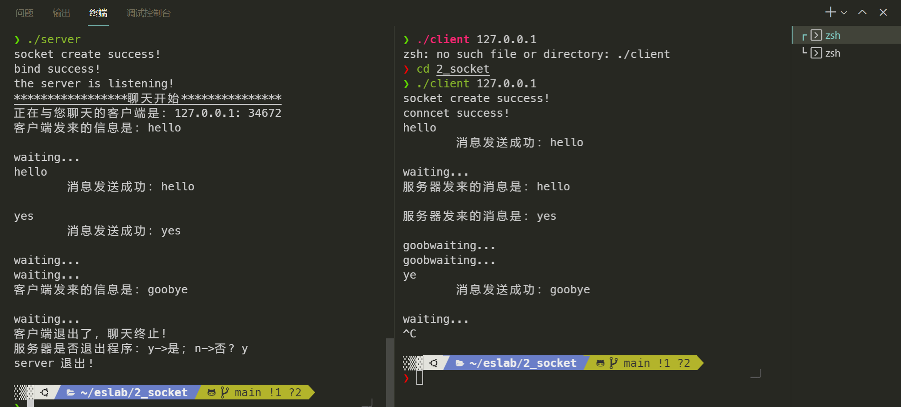
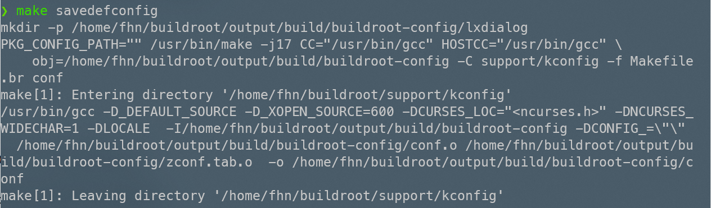
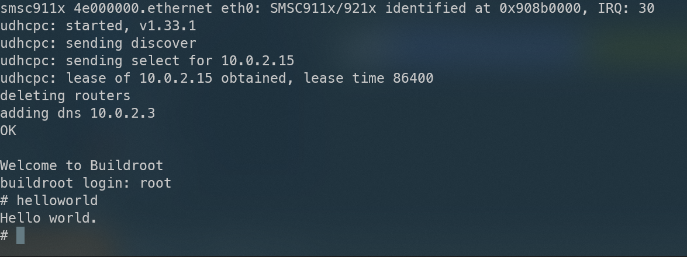
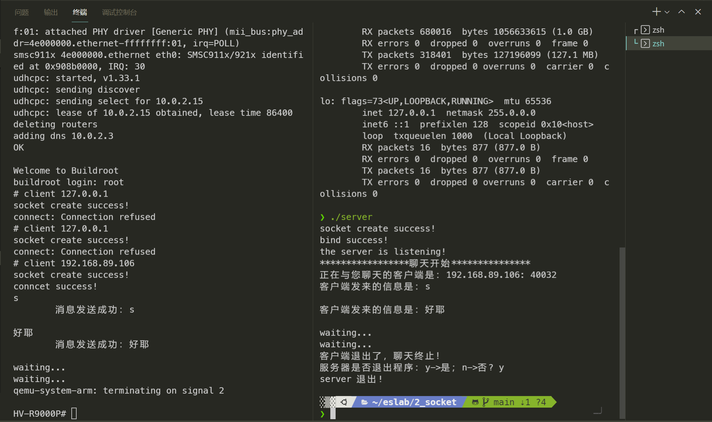

# lab2 编写 socket 通信程序，实现简单交互聊天功能

要求：
1. 能实现交互聊天即可。
2. 服务器端在主机运行，客户端在 qemu 模拟器中运行。

## 项目分析

这个项目分为两个大的部分：
1. socket编程实现聊天程序，基于经典的C/S结构分别编写server端和client端程序server.c和client.c。
2. 向buildroot中添加自定义程序。

实际上，由于第一部分相对偏应用，能找到比较好的开源代码以借鉴参考，问题的难点反而在于第二部分。

关于有两种实现思路：
1. 在buildroot中添加vi和gcc等，然后在运行时现场编写运行。
2. 在buildroot的menuconfig阶段就将相应的配置文件、源代码和Makefile编写好，然后重新make，将二进制的可运行文件写入文件系统中。

虽然第二种相对陌生，但由于buildroot有现成的tutorial，探索的成本也并不高。这种方式更接近硬件编程的思路，所以这里首先对第二种进行尝试。

## 项目实现

### socket编程

我们为了快速迭代，首先采用了https://www.cnblogs.com/liushao/p/6375377.html 中给出的示例代码。并在WSL Ubuntu20.04的不同终端之间进行了本地测试。




后续我们将对这个测试程序进行优化。

### 将自定义程序写入buildroot

参考https://www.cnblogs.com/arnoldlu/p/9553995.html的第五部分。

首先在package/Config.in中添加相关menu信息，可以看到整个配置文件的结构大体如下，我们最后一个endmenu之前添加自定义包的字段：

```shell
menu "Target packages"

# ....

menu "Personal packages"
	source "package/helloworld/Config.in"
	source "package/client/Config.in"
endmenu

endmenu
```

注意：

1. Config.in的编写利用menu和endmenu进行闭包和配对。不要混淆Target packages整个的endmenu和自己添加字段的endmenu，否则会报syntax error 
2. personal packages的名字是自定义的，不必要写成相同的。


随后向`package/helloworld/`这个目录下添加两个文件：

> 如果查看其他package的目录，发现还包括一个hash文件，但是对于功能不是必须的。

Config.in

```shell
config BR2_PACKAGE_HELLOWORLD
    bool "helloworld"
    help
      This is a demo to add local app.
```

helloworld.mk

```makefile
################################################################################
#
# helloworld
#
################################################################################

HELLOWORLD_VERSION:= 1.0.0
HELLOWORLD_SITE:= $(CURDIR)/work/helloworld
HELLOWORLD_SITE_METHOD:=local
HELLOWORLD_INSTALL_TARGET:=YES

define HELLOWORLD_BUILD_CMDS
    $(MAKE) CC="$(TARGET_CC)" LD="$(TARGET_LD)" -C $(@D) all
endef

define HELLOWORLD_INSTALL_TARGET_CMDS
    $(INSTALL) -D -m 0755 $(@D)/helloworld $(TARGET_DIR)/bin
endef

define HELLOWORLD_PERMISSIONS
    /bin/helloworld f 4755 0 0 - - - - -
endef

$(eval $(generic-package))
```


**编写之后，在buildroot目录下建立work/helloworld，并在其中写入源码和Makefile文件**：

```c
//helloworld.c
#include <stdio.h>

void main(void)
{
    printf("Hello world.\n");
}
```

```Makefile
CPPFLAGS += 
LDLIBS += 

all: helloworld

analyzestack: helloworld.o
	$(CC) $(CFLAGS) $(LDFLAGS) -o $@ $^ $(LDLIBS)

clean:
	rm -f *.o helloworld

.PHONY: all clean
```

**注意**：按照Makefile的语法，命令所在的两行开头都应当是tab制表符，否则会报错：

```shell
***missing separator. Stop
```

完成上述自定义，随后需要保存设置。


随后进入root模式，执行make命令，第三方自定义文件就被加入文件系统了。可以看到这时已经可以执行helloworld命令了。




### 综合

随后我们效仿helloworld程序的烧录方法，将client.c写入，在wsl端运行server，在qemu arm-linux上运行client程序，如下图，两者实现了通信。



当然，我们也可以直接将原有的helloworld文件重新编写，make clean之后重新make即可。

## 参考

https://www.cnblogs.com/liushao/p/6375377.html

https://www.cnblogs.com/arnoldlu/p/9553995.html
